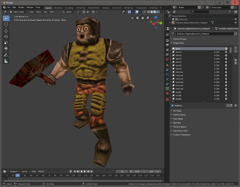

# Quake MDL import/export plugin for Blender

### About:
Mdl exporter/importer for Blender 2.8+ (and 2.7x). Originally developed by taniwha for QuakeForge, updated for Blender 2.8 by khreathor with a little help of queenjaz.

### Downloads:
- Blender 4.1+: [io_mesh_qfmdl.zip](https://github.com/khreathor/mdl-for-blender/releases/download/blender-4.1%2B/io_mesh_qfmdl.zip)
- Blender 2.8+: [io_mesh_qfmdl.zip](https://github.com/khreathor/mdl-for-blender/releases/download/blender-2.8%2B/io_mesh_qfmdl.zip)
- Blender 2.7x (legacy): [io_mesh_qfmdl.zip](https://github.com/khreathor/mdl-for-blender/releases/download/blender-2.7x(legacy)/io_mesh_qfmdl.zip)

### Tutorial (for 2.8+/4.1+ versions):
- [Installation](wiki/Installation.md)
- [Scene Setup](wiki/Scene%20Setup.md)
- [Materials](wiki/Materials.md)
- [Animations](wiki/Animations.md)
- [Example Model](wiki/Example.md)
- [MDL Knowledge Base](wiki/MDL%20Knowledge%20Base.md)

