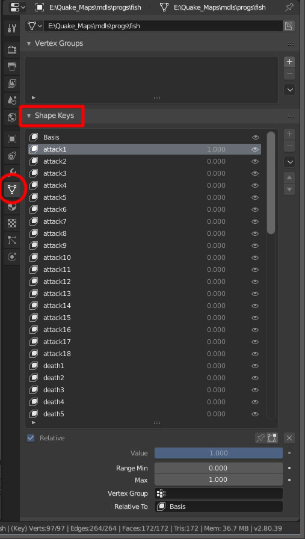

### Animations ###
Imported animation is represented as a sequence of animated **shape keys**

You don't have to bake your animations into shape keys when you export your new model. Armature and other types of animations should export properly.
