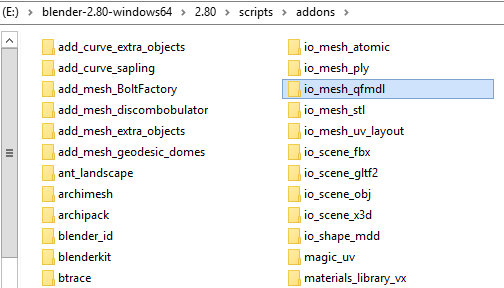
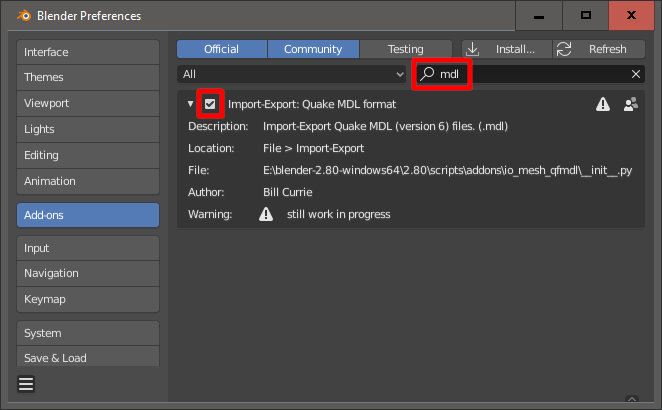
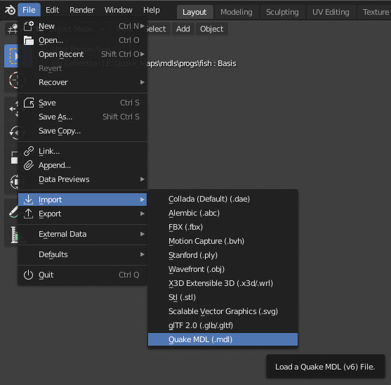

# How to install: #

* **1)** Extract folder (**io_mesh_qfmdl**) to **.../2.80/scripts/addons**:

* **2)** Go to **Add-ons** in Preferences (**Edit => Preferences...**), find **mdl** plugin and enable it:

* **3)** You should be able to **import/export MDLs** now!

