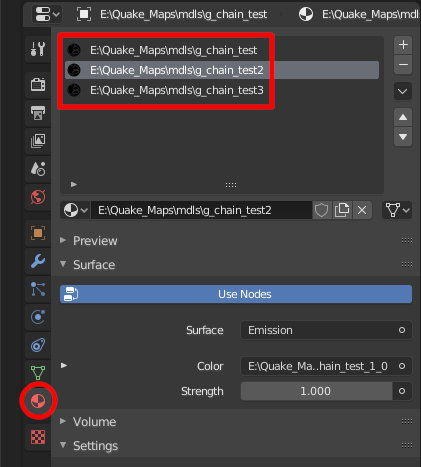
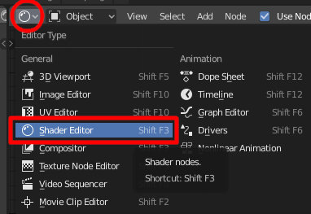
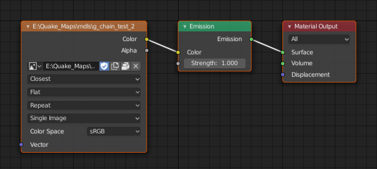
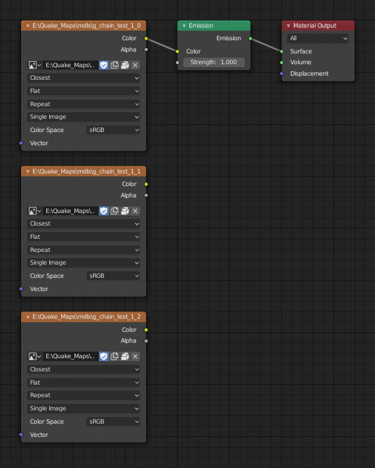

### Materials ###

> Before You start, I recommend You to import some existing MDL file first. This way You'll understand skin/material concept better

Every **skingroup** is represented as one **material** on a mesh. You can have multiple skingroups and each skingroup can have multiple **skins** inside.

In most cases, models will have one **skingroup** with one **skin** (which becomes a single skin setup). Image below shows a mesh with three skingroups:

* Open **Shader Editor** to see texture nodes:

* Most MDLs will have simple **skin** setup like this (image below). One **material** with one **texture**:

* **Skingroups** with multiple **skins** will look like this.:

You can see, that not all **textures** are connected to **shader**. They don't have to (...actually they can't be connected all at once...).

Skins are **ordered** by **vertical position** in a graph. It's important to keep them ordered like this (image above), otherwise you'll end up with a wrong sequence of skins in your skingroup animation.
