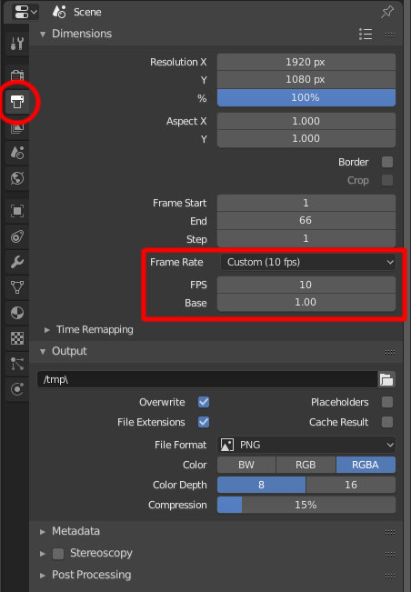
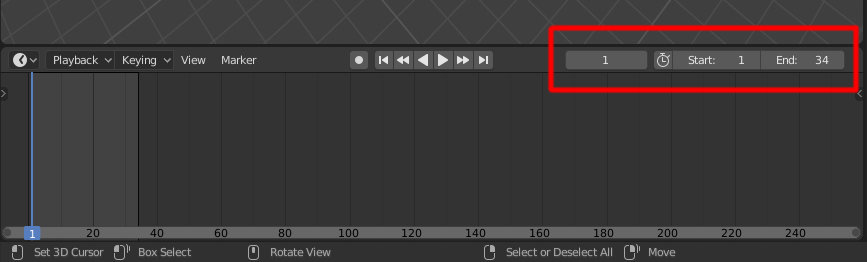
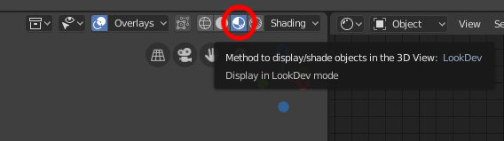

### Scene Setup ###
* **Quake**'s animations are displayed at **10 frames per second**. Set your scene frame rate to see them as intended:

* If you are working on a new **model with animations**, remember to set proper **animation range**. Otherwise it will export more/less frames then you intend to. When you import **existing MDL** model, animation range will **adjust automatically**:

* Textures will be visible in a scene, after you enable display mode called "**LookDev**": 

